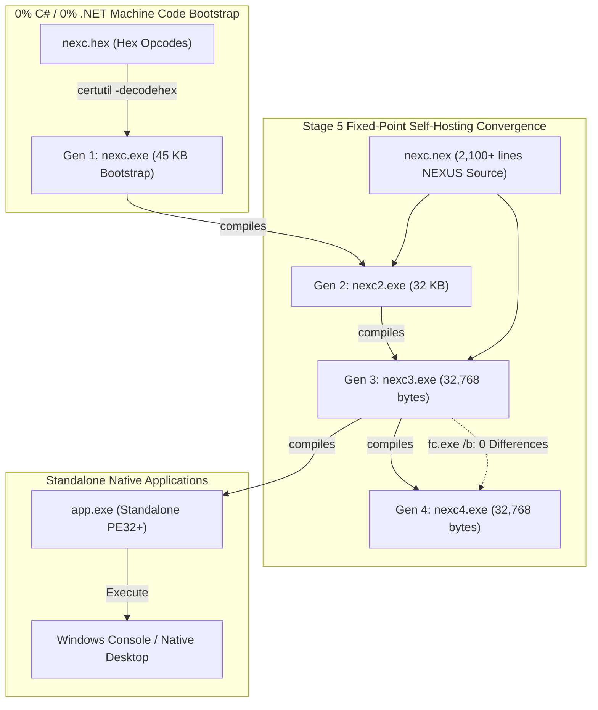
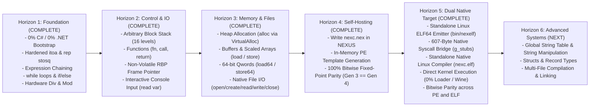

# Project NEXUS: Master Architecture & Specification
### The Autonomous Zero-Bootstrap Systems Language
**Target:** 100% Native x86-64 | 0% C# | 0% .NET Runtime | Zero Third-Party Toolchains

---

## 1. Vision & North Star

The mission of **Project NEXUS** is to build a complete, autonomous, self-hosting native programming language and operating environment on Windows from absolute zero.

Most programming languages are built atop existing giant ecosystems (C++, LLVM, Rust, or .NET). When external compilers and runtimes are stripped away, one faces the **Compiler Bootstrap Paradox**: *how can a language compile itself if no compiler exists to compile it in the first place?*

NEXUS solves this by bootstrapping directly through raw machine code synthesis via built-in operating system facilities (`certutil -decodehex`).

### The North Star Goal:
> **The Self-Hosting Milestone (Stage 5 - ACHIEVED):** 
> To write the NEXUS compiler entirely in NEXUS source code (`nexc.nex`), compile it with our native bare-metal compiler (`nexc.exe`), and produce a binary that compiles itself indefinitely—achieving total independence from any external runtime and attaining **100% bit-for-bit fixed-point parity**.

---

## 2. Current State: Stage 5 The Self-Hosting Horizon (v5.0 Verified)

The project features a fully self-hosting native compiler written entirely in NEXUS source code, compiling itself to produce a bitwise-identical standalone 32,768-byte PE32+ executable:



### Verified Features in Stage 5:
1. **100% Bit-for-Bit Fixed-Point Parity:**
   - Gen 3 compiler (`nexc3.exe`) compiles `nexc.nex` into Gen 4 (`nexc4.exe`).
   - `fc.exe /b nexc3.exe nexc4.exe` confirms **zero differences across all 32,768 bytes**.
   - Promoting `nexc3.exe` to `nexc.exe` compiles `nexc.nex` into `app.exe` with exact bitwise identity.
2. **Self-Hosting Compiler in Pure NEXUS (`nexc.nex`):**
   - 65,297 bytes of clean NEXUS code (~2,100 lines).
   - Lexer, parser, symbol table, jump patcher, PE header builder, and Win32 file I/O all written in NEXUS.
3. **Subroutines & Symbol Dispatch:**
   - Declared using `fn <name> { ... }`, executed using `call <name>`, with `return` support.
   - 32-bit polynomial identifier hashing (`h = (h * 33 + c) % 2000000000`) for robust name resolution.
   - Dynamic `E8 <disp32>` call generation and `E9 <disp32>` jump-over-function emission.
4. **Native File I/O in Language:**
   - `file_create`, `file_open`, `file_read`, `file_write`, and `file_close` wrapping Win32 kernel APIs.
5. **Heap Allocation & Scaled Pointers:**
   - `alloc <size>` invoking Windows `VirtualAlloc`.
   - Byte memory access (`load`, `store`) and 64-bit qword memory access (`load64`, `store64`) with scaled indexing (`[p + i * 8]`).
6. **Multi-Operator Chained Expression Evaluation:**
   - Arbitrary combinations of `+`, `-`, `*`, `/`, `%` evaluated left-to-right with signed hardware `idiv`.
7. **Negative Displacement Two's Complement Calculation:**
   - Correct negative 32-bit branch and loop offsets using 64-bit wrap-around arithmetic without integer overflow.
8. **Non-Destructive Line & Space Parsing:**
   - `skip_sp` skips only horizontal whitespace (ASCII 32 and 9), preserving newlines and preventing cross-statement token swallowing.

---

## 3. What Can We Build With Stage 5?

With complete self-hosting, file I/O, dynamic heap allocation, and structured subroutines:

### A. Autonomous System Compilers & Interpreters
- **Self-Hosting Toolchains:** Compilers that build themselves and other languages (e.g. Brainfuck, Forth, C subsets).
- **Custom Assemblers:** Pure native assemblers translating custom mnemonic assembly directly into Windows PE executables.

### B. File Processors & Data Engines
- **Hex Editors & Binary Patchers:** Utilities that inspect, modify, and analyze raw executable files.
- **Text Transformers & Formatters:** Code formatting, parsing, and source code transpilation.

### C. Native Desktop & Systems Applications
- **Interactive Shells & REPLs:** Standalone command-line environments with file system access.
- **Hardware Telemetry & Mathematical Simulators:** High-precision numerical computing running at bare-metal machine speed.

---

## 4. The Grand Technical Roadmap (Horizons 1 to 5)



---

## 5. Architectural Blueprint: Stage 5 Self-Hosting Engine

### 5.1 The Fixed-Point Bootstrap Chain
```
[nexc.hex] --(certutil -decodehex)--> [nexc.exe] (Gen 1 Bootstrap, 45 KB)
                                          |
                                    compiles nexc.nex
                                          v
                                    [nexc2.exe] (Gen 2, 32,768 bytes)
                                          |
                                    compiles nexc.nex
                                          v
                                    [nexc3.exe] (Gen 3, 32,768 bytes)
                                          |
                                    compiles nexc.nex
                                          v
                                    [nexc4.exe] (Gen 4, 32,768 bytes)
                                          |
                        fc.exe /b nexc3.exe nexc4.exe: 0 DIFFERENCES!
                                          |
                                    (bin/nexelf)
                                          v
                                    [nexc.elf] (Standalone Native Linux Compiler)
                                          |
                         nexc.elf compiles nexc.nex -> app.exe -> app.elf
                         cmp -l app.elf nexc.elf: 0 DIFFERENCES!
```

### 5.2 Key Compiler Subsystems in `nexc.nex`
- **PE Template Initializer (`fn init_pe`):** Synthesizes a 32,768-byte PE32+ image with valid DOS header, PE header, Optional Header (AMD64, GUI/Console subsystem), `.text`, `.rdata`, and `.data` sections, plus full Import Address Table (IAT) for `kernel32.dll`.
- **Lexical Tokenizer (`fn next_tok`, `fn skip_sp`, `fn skip_ws`):** Tokenizes source text, skips comments, parses integer literals (`parse_uint`), and computes 32-bit polynomial hashes for variable and function identifiers (`parse_ident`).
- **Code Generator (`fn emit_b`, `fn emit_d`, `fn emit_q`):** Emits x86-64 machine code bytes, 32-bit displacements, and 64-bit immediate constants into the `.text` section.
- **Control Flow Patcher (`fn patch_t`):** Manages a 16-level block stack, computing forward and backward 32-bit two's complement relative offsets.
- **File Exporter (`fn main`):** Reads input file `code.nex` via `file_open` / `file_read`, drives compilation, updates PE header sizes, and writes `app.exe` via `file_create` / `file_write` / `file_close`.

---

## 6. Verification and Regression Suites

NEXUS includes dual automated build and regression suites:

### A. Linux Master Build Script ([`build_all.sh`](file:///home/lifelonglearner/nexus_project/build_all.sh))
Executes all 10 automated stages:
1. **Step 1:** Builds native execution engines (`bin/nexload` and `bin/nexelf`).
2. **Step 2:** Compiles `master_test_suite.nex` with bootstrap compiler.
3. **Step 3:** Executes `app.exe` via `nexload` asserting all 27 regression points.
4. **Step 4:** Verifies interactive console input via stream piping (`interactive_calc.nex` and `prime_checker.nex`).
5. **Step 5:** Batch compiles and verifies all 9 example programs.
6. **Step 6:** Verifies compiler diagnostic reporting (exact Line and Column for 5 error conditions).
7. **Step 7:** Executes Gen 1 $\to$ Gen 2 $\to$ Gen 3 $\to$ Gen 4 self-hosting convergence proof (0 byte differences across 32,768 bytes).
8. **Step 8:** Promotes Gen 3 to active production compiler `nexc.exe`.
9. **Step 9:** Synthesizes standalone native Linux ELF64 compiler (`compiler/nexc.elf`).
10. **Step 10:** Direct Native Linux Kernel Execution:
    - 10A: Master test suite executed directly as `app.elf` (all 27 assertions verified on bare-metal kernel).
    - 10B: Interactive calculator and prime checker executed directly as ELF with piped input.
    - 10C: Batch execution of all 9 example programs as standalone ELF binaries.
    - 10D: Standalone `nexc.elf` self-hosting parity verified (0 differences across PE and ELF).

### B. Windows Master Build Script ([`build_all.ps1`](file:///home/lifelonglearner/nexus_project/build_all.ps1))
Executes the Windows-native 8-step build, GUI window assembly, and verification pipeline.

---

## 7. Next Horizons (Stage 7 & Beyond)

1. **Global String Literals & String Manipulation:**
   - First-class string variables, string concatenation, and string comparison.
2. **User-Defined Structs & Record Offsets:**
   - Named compound data types mapped to allocated heap memory blocks.
3. **Multi-File Compilation & Object Linking:**
   - Modular compilation units linked into a single native binary.
