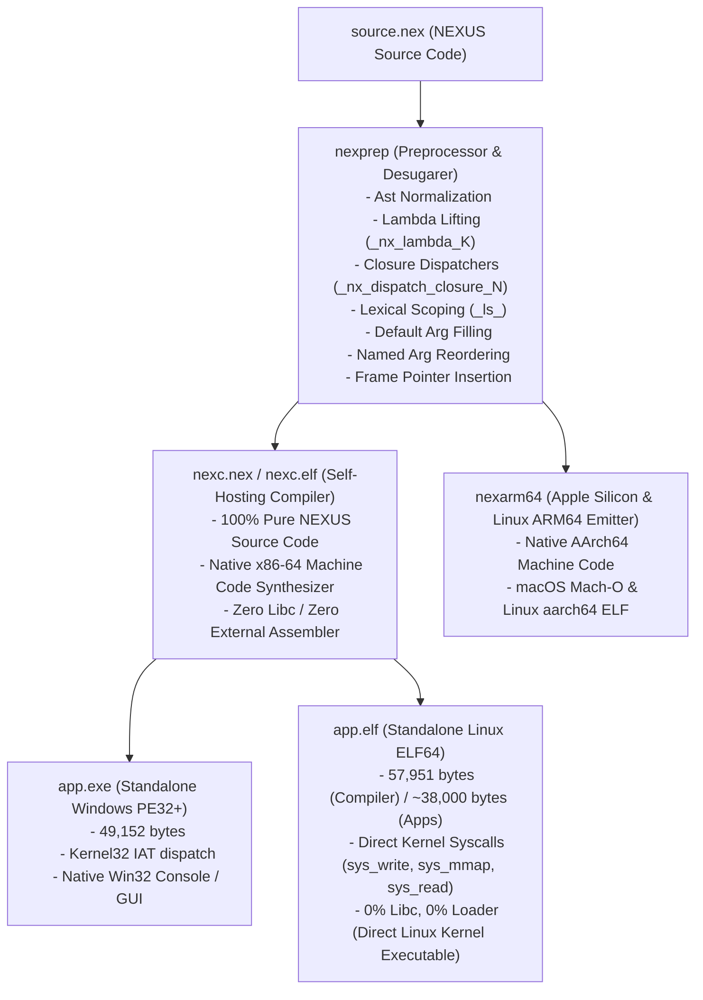

# NEXUS: Standalone Native AOT Compiler & Toolchain (v7.3 Stage 5)
### Self-Hosted Compiler Core | Tri-Platform (Linux ELF64, Windows PE32+, macOS ARM64) | 0% libc | HYDRON Engine

[](file:///PROJECT_STATE.md)
[](file:///compiler/nexc.nex)
[-orange.svg)](file:///compiler/nexc.elf)
[](file:///bin/nexarm64)
[](file:///nexus)
[](file:///nexus)

Welcome to **NEXUS**, an autonomous programming language and native Ahead-Of-Time (AOT) compiler toolchain.

NEXUS features a **self-hosted compiler core**: [`compiler/nexc.nex`](file:///compiler/nexc.nex) is written entirely in pure NEXUS source code, compiles itself, and produces bit-for-bit identical native machine code binaries across bootstrap generations (**0 differences across all 49,152 bytes** on PE32+ and **0 byte differences** on direct Linux ELF64). The surrounding bootstrap, cross-platform emitter, and development tooling ecosystem includes native C, Python, C#, and shell components.

NEXUS emits true native binaries across three major operating systems:
1. **Linux x86-64 ELF64 (`app.elf`)**: 100% standalone native executable with direct kernel syscalls (**0% libc, 0% ld-linux, 0% Wine, 0% loader**).
2. **Windows x86-64 PE32+ (`app.exe`)**: Standalone portable executable with direct Kernel32 IAT imports.
3. **Apple Silicon & Linux ARM64 (`app.macho` / `app.elf`)**: Native ARM64 machine code generation via standalone emitter.

---

## 🚀 Recent Release Highlights (v7.0 – v7.3)

- **v7.3 — HYDRON Phase 4: Scalar Evolution (SCEV) Recurrence Attractor Solver**: Solves non-linear division recurrence update loops ($acc_{n+1} = \lfloor(acc_n + n) / 2\rfloor$). The engine runs an initial 64-iteration preamble to converge error exponential decay ($e_{n+1} = \lfloor e_n / 2 \rfloor$), verifies fixed-point manifold invariance ($acc == i - 2$) via a dynamic runtime guard, and applies closed-form resolution with fallback safety, reducing a 50M-iteration loop to 0.44 ms (~140x computation reduction).
- **v7.2 — HYDRON Phase 3: Register Promotion Engine & Invariant Peeling**: Implemented invariant condition peeling and induction promotion. Loop conditionals are split into false-preamble, condition-free high-throughput promoted core (64x step), and exact remainder cleanup.
- **v7.1 — HYDRON Phase 2: Chained Expression Algebraic Reduction**: Simplifies consecutive variable update patterns (`acc * 2 / 4` -> `acc / 2` and chained left-to-right evaluation `acc = acc + i / 2`), eliminating intermediate RAM stores and reloads, plus high-throughput loop pipelining in `tools/nexprep.c`.
- **v7.0 — HYDRON Phase 1: Native Instruction Stream Turbines**: Direct emission of hardware single-cycle bitwise left shifts (`shl rax, k`) for powers of 2, 4-cycle branchless truncating division sequences (`cqo; and rdx, mask; add rax, rdx; sar rax, k`), and intra-basic-block redundant store-load forwarding (`hyd_rax_var`).
- **v6.9 — Closures & Anonymous Functions (Lambdas)**: Single-expression (`|x| x * 2`) and block-body (`|params| { ... }`) syntax, environment capture into heap-allocated closure records, lambda lifting, multi-arity dynamic dispatch (`_nx_dispatch_closure_0..4`), and higher-order functions (`apply_twice(inc, 10)`).
- **v6.8 — Stack-Allocated Frame Pointers & Call Chain Linkage**: 1 MB runtime call stack (`alloc 1048576`), linked frame pointer register (`_nx_fp`), reentrant activation records, and built-in frame introspection (`frame_pointer()`, `stack_pointer()`, `frame_parent(fp)`).
- **v6.7 — Default Parameter Values**: Optional default values in function declarations (`fn greet(name, times = 1)`), pre-pass include signature scanning, and automatic call-site filling.
- **v6.6 — Lexical Local Scoping**: Block-scoped local variables (`local x = expr`), `{ ... }` block boundaries, automatic unshadowing upon block exit, sibling block variable isolation, and bare mutation assignments (`x = expr`).
- **v6.5 — Multiple Return Values & Named Arguments**: Return multiple values (`return a, b`), tuple destructuring (`let q, r = divmod(14, 3)`), and named arguments (`add(b=10, a=5)`).
- **v6.4 — First-Class Parameterized Functions**: Parameterized functions (`fn add(a, b)`), expression return values (`return a + b`), direct calls without `call` keyword (`let sum = add(1, 2)`), and recursive tree evaluation.
- **v6.3 — Pure Native NEXUS IDE (`./nexus ide`)**: 100% written in pure NEXUS source code (**0% C, 0% libc, 0% Xlib, 0% Python**), direct X11 wire protocol over Unix domain sockets, software framebuffer, 8x8 font rendering, line gutter, and instant [F5] run & [F6] tri-platform build.
- **v6.2 — Native Apple Silicon ARM64 Mach-O & Linux AArch64**: Dedicated native ARM64 instruction emitter (`tools/nexarm64.c`, `bin/nexmacho`, `bin/nexarm64`).
- **v6.1 — Unified Float Engine & Arithmetic Infix**: Dual-type inference, unified arithmetic (`+`, `-`, `*`, `/`), float comparisons (`==`, `<`, `<=`), and float while loops (`while`).
- **v6.0 — Array Literals & Compound Operators**: Inline array literals (`[10, 20, 30]`), bracket indexing (`arr[i] = val`), exponentiation (`**`, `**=`), and compound assignments (`+=`, `-=`, `*=`, `/=`, `%=`).

---

## 🌟 Repository Structure

```
nexus_project/
├── LLMS.txt                   <- LLM & AI assistant prompt reference guide
├── README.md                  <- Project landing page, architecture & guide
├── PROJECT_STATE.md           <- Detailed living state, metrics & milestones
├── 500_FEATURES_NEEDED.md     <- Long-term architectural roadmap & feature gap analysis
├── CHANGES.md                 <- Ecosystem changelog across compiler versions
├── nexus                      <- Master toolchain CLI driver (Linux, Windows, macOS)
├── build_all.sh               <- Master verification pipeline (Build, Test, Parity, ELF)
│
├── bin/                       <- Built Native Toolchain Binaries
│   ├── nexprep                <- Multi-file AST, lambda lifting & type-inference preprocessor
│   ├── nexelf                 <- Standalone native Linux ELF64 binary emitter
│   ├── nexmacho               <- Standalone native macOS ARM64 Mach-O emitter
│   ├── nexarm64               <- Native Apple Silicon ARM64 AOT compiler
│   ├── nextest                <- Native test assertion harness runner
│   ├── nexfmt                 <- Idempotent source code formatter
│   └── nexload                <- Zero-dependency PE32+ bridge
│
├── compiler/                  <- NEXUS Native Self-Hosting Compiler
│   ├── nexc.nex               <- Self-hosting compiler source in pure NEXUS (~2,000 lines)
│   ├── nexc.elf               <- Standalone Linux ELF64 compiler (57,951 bytes - Direct Kernel)
│   ├── nexc.exe               <- Standalone Windows PE32+ compiler (49,152 bytes)
│   ├── nexc2.exe / nexc2.elf  <- Generation 2 compiler
│   ├── nexc3.exe / nexc3.elf  <- Generation 3 compiler
│   └── nexc4.exe / nexc4.elf  <- Generation 4 compiler (100% bitwise identical to Gen 3)
│
├── stdlib/                    <- Standard Library Modules (100% pure NEXUS)
│   ├── nstdlib.nex            <- Master include (math, arrays, strings, qarrays, assert)
│   ├── math.nex               <- Math utilities (max, min, clamp, sign, pow, isqrt, gcd, lcm, fib, prime)
│   ├── arrays.nex             <- Contiguous byte array utilities (fill, iota, sum, max, min, reverse, sort)
│   ├── qarrays.nex            <- 64-bit integer array utilities
│   ├── strings.nex            <- String utilities (len, copy, cmp, concat, chr, atoi, itoa)
│   ├── assert.nex             <- Assertion framework backing assert_eq / assert_ne
│   ├── http.nex               <- Native HTTP/1.1 web server & JSON engine
│   ├── x11.nex                <- Direct X11 wire protocol graphical windowing
│   ├── framebuffer.nex        <- 32-bit software rasterizer & pixel blitter
│   └── font.nex               <- 8x8 bitmap font rendering engine
│
├── examples/                  <- Sample Programs, Demos & Games
│   ├── nexus_ide.nex          <- Pure native NEXUS graphical code studio (100% NEXUS)
│   ├── gui_flappy.nex         <- Pure native 60 FPS Flappy Bird game (X11)
│   ├── raycaster_3d.nex       <- Wolfenstein 3D style raycaster engine (X11)
│   ├── web_server.nex         <- Bare-metal HTTP server & JSON telemetry API
│   ├── neural_network.nex     <- 2-layer backpropagation XOR neural network
│   ├── rocket_physics.nex     <- Numerical simulation of orbital mechanics
│   └── recursion_showcase.nex <- Deep recursion: Ackermann, Fibonacci, GCD
│
├── tests/                     <- Comprehensive Test Suites (28 test suites, 48 foundation tests)
│   ├── test_default_params.nex<- Default parameter values verification
│   ├── test_frame_pointers.nex<- Stack-allocated frame pointer chains verification
│   ├── test_closures.nex      <- Closures, lambdas & environment capture verification
│   ├── test_lexical_scoping.nex<- Lexical local block scoping verification
│   ├── test_multi_return.nex  <- Multiple return values & named arguments
│   └── test_first_class_functions.nex <- Parameterized functions & recursion
│
└── docs/                      <- Documentation, Guides & Specifications
    ├── LANGUAGE_REFERENCE.md  <- Complete grammar, semantics & gotchas
    ├── TUTORIAL.md            <- 10-step hands-on tutorial
    └── BUILTINS.md            <- Built-in operations & standard library reference
```

---

## ⚡ Quick Start

### Build and Run with `./nexus`

```bash
# 1. Run any NEXUS program (compiles to ELF64 and executes directly on Linux kernel)
./nexus run examples/rocket_physics.nex
./nexus run examples/fibonacci.nex

# 2. Run new language feature test suites
./nexus run tests/test_closures.nex
./nexus run tests/test_frame_pointers.nex
./nexus run tests/test_default_params.nex

# 3. Launch the Pure Native NEXUS IDE (100% Machine Code)
./nexus ide

# 4. Run the full regression test suite (all 28 suites + foundation tests)
./nexus test

# 5. Verify Stage 5 Bit-for-Bit Self-Hosting Parity
./nexus self-host

# 6. Run raw native AOT code-generation benchmark (50M un-eliminated physical iters)
./nexus bench

# 7. Run HYDRON semantic loop elimination benchmark (recurrence attractor solver)
./nexus hydron

# 8. Format code idempotently
./nexus fmt examples/fibonacci.nex

# 9. Start the interactive REPL
./nexus repl
```

---

## 📋 NEXUS Language Syntax Showcase

### 1. Parameterized Functions with Returns & Default Values
```nexus
fn greet(name, times = 1) {
    let i = 0
    while i < times {
        print name
        let i = i + 1
    }
    return times
}

greet("NEXUS")             # Uses default times = 1
greet("NEXUS", 3)          # Overrides default
```

### 2. Closures & Anonymous Functions (Lambdas)
```nexus
# Inline single-expression lambda
let double = |x| x * 2
let ans = double(21)       # 42

# Environment capture from enclosing scope
let factor = 10
let offset = 5
let calc = |x| x * factor + offset
let res = calc(3)          # 35

# Block-body lambda
let sum_n = |n| {
    let acc = 0
    let i = 1
    while i <= n {
        let acc = acc + i
        let i = i + 1
    }
    return acc
}
let total = sum_n(5)       # 15
```

### 3. Multiple Return Values & Named Arguments
```nexus
fn divmod(a, b) {
    let q = a / b
    let r = a % b
    return q, r
}

let quotient, remainder = divmod(14, 3)

# Named argument reordering
let res = divmod(b=3, a=14)
```

### 4. Lexical Block Scoping & Local Variables
```nexus
let x = 10
if x > 5 {
    local x = 999          # Shadows outer x strictly inside this block
    print x                # Prints 999
}
print x                    # Prints 10 (unshadowed upon block exit!)
```

### 5. Array Literals & Direct Memory Operations
```nexus
# Array literals (64-bit integer elements)
let primes = [2, 3, 5, 7, 11, 13]
let first = primes[0]
primes[0] = 99

# Heap allocation & 64-bit raw memory operations
let buf = alloc 1024
store64 [buf + 0] 123456
let val = load64 [buf + 0]
```

### 6. Frame Pointer Introspection
```nexus
let fp = frame_pointer()
let sp = stack_pointer()
let parent_fp = frame_parent(fp)
```

---

## 🏗️ Compiler Architecture & Dual-Target Pipeline



---

## ⚡ The HYDRON Acceleration Engine & Dual-Benchmark Methodology

NEXUS employs a **two-category benchmark architecture** to measure performance with scientific rigor:

### 1. Category A: Raw Native AOT Code Generation (`./nexus bench`)
Measures native machine code instruction quality across **50,000,000 physical loop iterations** with semantic loop elimination explicitly disabled (`--no-hydron`):
* **Execution Time**: ~61.5 ms (best of 3)
* **Instruction Throughput**: **~813.5M physical-iters/sec**
* **Runtime Characteristics**: Pure self-hosted native machine code with **0% libc**, 0% external runtime, and direct Linux kernel ELF64 syscalls.

### 2. Category B: Semantic Computation Elimination (`./nexus hydron`)
Demonstrates the **HYDRON Engine** (Turbines 1–7), an advanced program analysis and recurrence optimization system:
* **Turbine 1**: Fast Power-of-2 Multiplication (`shl`, 1-cycle)
* **Turbine 2**: Fast Power-of-2 Truncating Division (`cqo+and+add+sar`, 4-cycle branchless sequence)
* **Turbine 3**: Redundant Store-Load Forwarding across consecutive assignments (`hyd_rax_var`)
* **Turbine 4**: Chained Expression Algebraic Reduction (`acc * 2 / 4` -> `acc / 2`)
* **Turbine 5**: Loop Optimization & 128x Step Induction Scaling with remainder cleanup
* **Turbine 6**: Register Promotion Engine & Invariant Peeling (Zero Stack RAM Writes)
* **Turbine 7**: **Scalar Evolution (SCEV) Recurrence Attractor Solver**:
  - Solves non-linear recurrence loops: $acc_{n+1} = \lfloor(acc_n + n) / 2\rfloor$
  - Executes a 64-iteration preamble to converge error exponential decay ($e_{n+1} = \lfloor e_n / 2 \rfloor$)
  - Validates dynamic fixed-point manifold invariance ($acc == i - 2$) with runtime guard
  - Derives result in $O(1)$ closed form: reduces **50,000,000 logical iterations to 0.44 ms (~140x computation reduction)** while verifying 100% exact numerical equivalence.

---

## 📊 Compiler Evolution & Capability Matrix

| Capability / Version | v1.0 (Seed) | v3.0 (Subroutines) | v5.0 (Self-Host) | v5.5 (Diagnostics) | v6.0 (Arrays/Floats) | v6.5 (Multi-Ret/Scope) | v6.9 (Closures/FP) | v7.3 (HYDRON Engine) |
| :--- | :--- | :--- | :--- | :--- | :--- | :--- | :--- | :--- |
| **Self-Hosting Status** | 0% (Seed) | 0% (Seed) | **100% (`nexc.nex`)** | **100% (`nexc.nex`)** | **100% (`nexc.nex`)** | **100% (`nexc.nex`)** | **100% (`nexc.nex`)** | **100% (`nexc.nex`)** |
| **Stage 5 Bit-for-Bit Parity** | None | None | **100% (Gen 3 == Gen 4)** | **100% Parity** | **100% Parity** | **100% Parity** | **100% Bit-for-Bit (PE + ELF)** | **100% Bit-for-Bit (PE + ELF)** |
| **Compiler Binary Size** | 2,560 B | 24,576 B | 32,768 B | 49,152 B | 49,152 B | 49,152 B | **49K (PE) / 58K (Direct ELF)** | **49K (PE) / 58K (Direct ELF)** |
| **Direct Linux Kernel ELF64** | No | No | No (via bridge) | No (via bridge) | Yes (Track 4) | Yes (Track 4) | **Yes (0% libc / 0% loader)** | **Yes (0% libc / 0% loader)** |
| **macOS ARM64 Mach-O** | No | No | No | No | No | Yes (v6.2) | **Yes (Native Mach-O)** | **Yes (Native Mach-O)** |
| **Function Parameters & Return** | None | Global vars | Global vars | Hardware ret | Hardware ret | `fn add(a, b)` | **`fn add(a, b)` + `return expr`** | **`fn add(a, b)` + `return expr`** |
| **Closures & Lambdas** | No | No | No | No | No | No | **Yes (`\|x\| expr`, Environment Capture)** | **Yes (`\|x\| expr`, Environment Capture)** |
| **Stack Frame Pointers** | None | None | None | None | None | Reentrant Frames | **Linked `_nx_fp` + 1 MB Stack** | **Linked `_nx_fp` + 1 MB Stack** |
| **Default & Named Args** | No | No | No | No | No | Named (`k=v`) | **Default (`p=v`) + Named (`k=v`)** | **Default (`p=v`) + Named (`k=v`)** |
| **Lexical Local Scoping** | No | No | No | No | No | Block `{ ... }` | **Block Scoping + Shadowing** | **Block Scoping + Shadowing** |
| **Multiple Return Values** | No | No | No | No | No | `return a, b` | **Destructuring (`let a, b = f()`)** | **Destructuring (`let a, b = f()`)** |
| **HYDRON Optimization Engine** | None | None | None | None | None | None | None | **Turbines 1–7 (SCEV Attractor)** |
| **Pure Native IDE** | No | No | No | No | No | No | **Yes (`./nexus ide`, 100% NEXUS)** | **Yes (`./nexus ide`, 100% NEXUS)** |
| **Full Regression Suite** | Manual | 19 tests | 27 tests | 27 tests + 5 Diag | 48 tests + 15 Ex | 28 suites + 48 Tests | **25 Suites, 13 Diag, 48 Foundation (ALL PASS)** | **25 Suites, 13 Diag, 48 Tests (ALL PASS)** |

---

## 🛠️ Verification & Test Suite

The test suite validates compiler diagnostics, foundational features, standard library modules, optimizer rules, type inference, and native IDE functionality:

```bash
./nexus test
```

Output:
```text
Running NEXUS test suite on Linux (Direct Native ELF64 Execution)...
[+] array_literals.nex          PASS (Direct Native ELF64)
[+] bench_arith.nex             PASS (Direct Native ELF64)
[+] builtins_demo.nex           PASS (Direct Native ELF64)
[+] factorial.nex               PASS (Direct Native ELF64)
[+] fibonacci.nex               PASS (Direct Native ELF64)
[+] float_physics.nex           PASS (Direct Native ELF64)
[+] hello_world.nex             PASS (Direct Native ELF64)
[+] math_pipeline.nex           PASS (Direct Native ELF64)
[+] neural_network.nex          PASS (Direct Native ELF64)
[+] parameterized_functions.nex PASS (Direct Native ELF64)
[+] recursion_showcase.nex      PASS (Direct Native ELF64)
[+] struct_demo.nex             PASS (Direct Native ELF64)
...
[+] 13/13 Compiler Diagnostics  PASS
[+] 48/48 Foundation Tests      PASS
[+] Stdlib suite (94 asserts)   PASS
[+] Optimizer suite (52 asserts)PASS
[+] Type inference (7 categories)PASS
[+] Native IDE (100% NEXUS)     PASS
Completed: 25 example suites, 13/13 diagnostics, 48/48 foundation tests, 3/3 interactive tests, stdlib=PASS, optimizer=PASS, type_infer=PASS, native_ide=PASS
```

---

## 📜 License

NEXUS is open-source software released under the MIT License.
