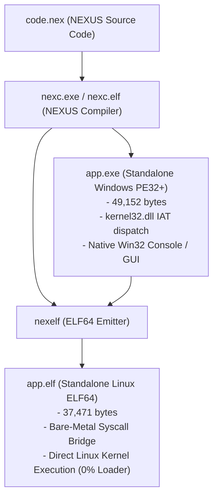

# NEXUS: Standalone Native AOT Compiler & Toolchain (v5.0 Stage 5 + Track 4)
### 100% Native x86-64 Machine Code | Dual Target (Windows PE32+ & Linux ELF64) | 0% C# | 0% .NET Runtime

Welcome to **NEXUS**, a fully autonomous, self-hosting native toolchain and programming language compiler built from the ground up without using C#, .NET runtime, Visual Studio, MSVC, Clang, GCC, NASM, or any third-party SDKs. 

Every executable in this project is pure bare-metal x86-64 machine code synthesized on Windows via byte arrays and decoded using the operating system's native `certutil -decodehex`.

In **Stage 5 (The Self-Hosting Horizon)**, the compiler itself is written in NEXUS source code ([`nexc.nex`](file:///compiler/nexc.nex)), compiles itself, and produces a bit-for-bit identical binary across compiler generations with **0 differences across all 49,152 bytes**!

**v5.3 highlights:** `break` / `continue` / C-style `for` (comma separators) are now
built into the self-hosting compiler, the output image grew to 49,152 bytes with
relocated runtime helpers, incremental project builds cache dependencies in
`.nexuscache` (`nexus build <file>`), and a native test runner
(`bin/nextest`, `nexus test --file <test.nex>`) validates `assert_eq` /
`assert_ne` assertions — plus a 10-function qword array module in the stdlib.

In **Track 4 (Direct Native Linux ELF64 Emission)**, NEXUS emits dual native binaries: standalone Windows PE32+ executables (`app.exe`) and standalone Linux ELF64 executables (`app.elf`) capable of direct kernel execution with **0% runtime loader (`nexload`), 0% Wine, 0% Mono, and 0% C runtime**!

---

## 🌟 What Is Included

```
nexus_project/
│
├── README.md                  <- High-level guide, capacity table & quick start
├── PROJECT_STATE.md           <- Active living state, metrics & completed milestones
├── CHANGES.md                 <- Ecosystem changelog across compiler versions
├── nexus                      <- Unified toolchain CLI driver (Linux & cross-platform)
├── build_all.sh               <- Master verification pipeline (build, test, parity, direct ELF)
│
├── bin/                       <- Built Native Toolchain Binaries
│   ├── nexload                <- Zero-dependency PE32+ bare-metal bridge for Linux
│   ├── nexelf                 <- Standalone native Linux ELF64 emitter
│   ├── nexmacho               <- Standalone native macOS ARM64 Mach-O emitter
│   ├── nexarm64               <- Native Apple Silicon ARM64 AOT compiler
│   ├── nexprep                <- Multi-file AST & type-inference preprocessor
│   ├── nextest                <- Native test assertion runner
│   └── nexfmt                 <- Idempotent source code formatter
│
├── compiler/                  <- NEXUS Native Self-Hosting Compiler
│   ├── nexc.nex               <- Self-hosting compiler source in pure NEXUS (~2,000 lines)
│   ├── nexc.exe               <- Standalone native Windows compiler (49,152 bytes)
│   ├── nexc.elf               <- Standalone native Linux compiler (57,951 bytes - Direct Kernel)
│   ├── nexc.hex               <- Hex bootstrap compiler seed
│   ├── template.bin           <- Master PE32+ image template
│   ├── elf_parts.bin          <- Master ELF64 header parts template
│   ├── nexc2.exe / nexc2.elf  <- Gen 2 compiler
│   ├── nexc3.exe / nexc3.elf  <- Gen 3 compiler
│   └── nexc4.exe / nexc4.elf  <- Gen 4 compiler (100% bitwise identical to Gen 3)
│
├── stdlib/                    <- Standard Library Modules (100% pure NEXUS)
│   ├── http.nex               <- Pure native HTTP/1.1 web server & JSON engine
│   ├── x11.nex                <- Direct X11 wire protocol graphical windowing
│   ├── framebuffer.nex        <- 32-bit software rasterizer & pixel blitter
│   ├── font.nex               <- 8x8 bitmap font rendering engine
│   ├── sound.nex              <- Chiptune audio synthesizer & DSP
│   ├── combinatorics.nex      <- Factorials, permutations, combinations
│   ├── sets.nex               <- Linear sorted set theory operations
│   ├── number_theory.nex      <- Modular arithmetic, totient, tetration
│   ├── linalg.nex             <- Vector & matrix linear algebra
│   ├── complex.nex            <- Complex arithmetic & Mandelbrot fractals
│   ├── rational.nex           <- Irreducible rational fraction arithmetic
│   ├── statistics.nex         <- SplitMix64 PRNG, mean, variance, median
│   └── calculus.nex           <- Finite differences, Simpson's integration
│
├── tools/                     <- Toolchain Source Code
│   ├── nexstudio.py           <- Built-in NEXUS Studio visual IDE & F5 runner
│   ├── nexarm64.c             <- Native ARM64 Apple Silicon & Linux AArch64 compiler
│   ├── nexprep.c              <- Multi-file preprocessor & type inference engine
│   ├── nexload.c              <- PE32+ execution bridge for Linux
│   ├── nexelf.c               <- Standalone Linux ELF64 binary emitter
│   ├── nexmacho.c             <- Mach-O 64-bit emitter
│   ├── nexfmt.c               <- Source formatter
│   └── nextest.c              <- Test harness runner
│
├── examples/                  <- Sample NEXUS Programs & Graphical Games
│   ├── gui_flappy.nex         <- Pure native 60 FPS Flappy Bird game (X11)
│   ├── raycaster_3d.nex       <- Wolfenstein 3D style raycaster engine (X11)
│   ├── web_server.nex         <- Bare-metal HTTP server & JSON telemetry API
│   ├── neural_network.nex     <- 2-layer backpropagation XOR neural network
│   ├── recursion_showcase.nex <- Deep recursion: Ackermann, Fibonacci, GCD
│   └── ...
│
├── tests/                     <- Comprehensive Test Suites (28 suites, 48 foundation tests)
└── docs/                      <- Architecture, Language Reference & Verification Reports
    ├── LANGUAGE_REFERENCE.md  <- Complete specification & reference manual
    ├── archive/               <- Historical development specifications and logs
    └── ...
```

---

---

## 🧰 The NEXUS Ecosystem (New)

Beyond the compiler itself, the project now ships a full developer ecosystem:

| Component | Location | What you get |
|-----------|----------|--------------|
| **Pure Native IDE** | `./nexus ide` | 100% pure NEXUS code editor (**0% Python / 0% libc / 0% Xlib**): syntax highlighting, line gutter, real-time typing, F5 compile & run, F6 tri-platform build |
| **NEXUS Studio (Tk)** | `./nexus edit` | Visual desktop IDE (`tools/nexstudio.py`): editor, syntax highlighting, F5 runner, example browser |
| **Standard library** | `stdlib/` | 26 tested functions: math (`nx_max`, `nx_pow`, `nx_isqrt`, `nx_gcd`, `nx_is_prime`...), byte arrays (`nx_arr_fill`, `nx_arr_sum`, `nx_arr_reverse`...), strings (`nx_str_cmp`, `nx_str_concat`, `nx_str_to_int`, `nx_int_to_str`...). One include loads it all: `include "stdlib/nstdlib.nex"` |
| **Documentation** | `docs/` | `LANGUAGE_REFERENCE.md` (complete grammar + gotchas), `TUTORIAL.md` (10-step hands-on), `BUILTINS.md` (built-ins + stdlib API) |
| **Interactive REPL** | `./nexus repl` | stateful line-by-line session, stdlib preloaded, bad lines rejected without killing the session, `:save`/`:clear`/`:stdlib off` |
| **Project scaffolding** | `./nexus new <name>` | ready-to-build project with vendored stdlib, manifest and standalone `build.sh` |
| **Source formatter** | `./nexus fmt <file>` | stable indentation/whitespace normalization, idempotent, `--check` mode |
| **VS Code extension** | `editors/vscode-nexus/` | full `.nex` syntax highlighting: keywords, built-ins, stdlib functions, struct members |
| **Test suites** | `tests/` | `stdlib_test.nex` — 94 executable assertions over all 26 stdlib functions |
| **Preprocessor v2** | `tools/nexprep.c` | clean-room C source (was binary-only): per-object struct typing, ancestor-aware include resolution, cycle guard |

Run the whole verification pipeline any time:

```bash
./nexus build    # 10-stage pipeline incl. bit-for-bit self-hosting proof
./nexus test     # 17 examples + 5 diagnostics + 15 foundation + 94 stdlib assertions
```

---

## ⚡ Quick Start

### On Linux (Ubuntu, Debian, Arch, Fedora, etc.)
NEXUS runs natively on Linux with zero external toolchains, emitting dual Windows PE32+ and Linux ELF64 binaries:
```bash
# 1. Build and verify full pipeline (All 10 Steps: Build, Test, Parity, Direct ELF)
./build_all.sh
# or using the NEXUS CLI:
./nexus build

# 2. Run any NEXUS program (compiles to ELF64 and executes directly on Linux kernel)
./nexus run examples/rocket_physics.nex
./nexus run examples/fibonacci.nex

# 3. Compile a program to dual binaries (app.exe and app.elf)
./nexus compile examples/factorial.nex

# 4. Convert any NEXUS PE32+ executable to native Linux ELF64
./nexus elf compiler/app.exe compiler/app.elf

# 5. Run automated test suite (direct ELF64 kernel execution)
./nexus test

# 6. Verify Stage 5 self-hosting fixed-point parity across PE32+ and ELF64
./nexus self-host
```

### Cross-Platform Execution via `./nexus`
The master toolchain driver `./nexus` handles all compilation, native execution, testing, and self-hosting parity checks across platforms:
- **Launch NEXUS Studio IDE:** `./nexus edit` or `./nexus edit <file.nex>` (press F5 to run!)
- **Build & verify:** `./build_all.sh` or `./nexus build`
- **Compile tri-platform:** `./nexus compile examples/builtins_demo.nex`
- **Native Apple Silicon ARM64:** `./nexus compile --target arm64-macos examples/builtins_demo.nex app.macho`
- **Native Linux AArch64:** `./nexus compile --target linux-aarch64 examples/builtins_demo.nex app.elf`
- **Interactive graphical game:** `./nexus play examples/gui_flappy.nex`
- **Full regression test suite:** `./nexus test`
- **Bit-for-bit self-hosting verification:** `./nexus self-host`

---

## 📋 The NEXUS Language Reference

NEXUS is an ahead-of-time (AOT) compiled imperative systems language emitting standalone 64-bit Windows PE executables.

### Supported Syntax:
- **Variable Declarations & Assignment:**
  ```nex
  let a = 12
  let b = 8
  ```
- **Expression Chaining & Hardware Division/Modulo (`+`, `-`, `*`, `/`, `%`):**
  ```nex
  let c = 100 / 4 + 5 * 2 - 10   # Evaluated left-to-right
  let m = 100 % 30               # Hardware remainder via cqo; idiv rbx
  ```
- **Arbitrary Block Stack (Nested Conditionals & Loops):**
  Supports arbitrary nesting depth (up to 16 levels) for `while` inside `while`, `if` inside `while`, `while` inside `if`, and `if`/`else` chains.
  ```nex
  let r = 1
  let total = 0
  while r <= 3 {
      let c = 1
      while c <= 4 {
          let total = total + 1
          let c = c + 1
      }
      let r = r + 1
  }
  ```
- **Functions & Subroutines (`fn`, `call`, `return`):**
  Named subroutines with polynomial hash symbol dispatch, non-volatile `rbp` frame pointer preservation across call boundaries, and early `return`:
  ```nex
  fn is_even {
      let m = x % 2
      if m == 0 {
          let e = 1
          return
      }
      let e = 0
  }

  let x = 14
  call is_even
  print e   # Prints 1
  ```
- **Interactive Console Input (`read <var>`):**
  Stream-preserving signed decimal integer reader directly from Win32 `ReadFile`:
  ```nex
  print "Enter a number:"
  read n
  let s = n * n
  print "Square:"
  print s
  ```
- **Dynamic Heap Memory Allocation (`alloc`):**
  ```nex
  let p = alloc 1024       # Allocate 1024 bytes via Win32 VirtualAlloc
  ```
- **Byte-Level Memory Storage & Load (`store`, `load`):**
  ```nex
  store [p + 0] 42         # Store byte 42 at p + 0
  let a = load [p + 0]     # Load byte from p + 0 into a
  let k = load [p + 0] + 5 # Direct chaining in expressions!
  ```
- **64-bit Array Storage & Load (`store64`, `load64`):**
  ```nex
  store64 [p + i * 8] 999  # Scaled 64-bit qword store
  let val = load64 [p + i * 8]
  ```
- **Native OS File I/O (`file_create`, `file_open`, `file_read`, `file_write`, `file_close`):**
  ```nex
  let f = file_create "log.txt"
  let b = alloc 32
  store [b + 0] 65         # 'A'
  file_write f b 1
  file_close f

  let g = file_open "log.txt"
  let r = alloc 32
  let n = file_read g r 32
  file_close g
  ```
- **Relational Operators:**
  `==`, `!=`, `<`, `<=`, `>`, `>=`
- **String Printing:**
  ```nex
  print "Hello from Bare-Metal x86-64!"
  ```
- **Integer / Variable Printing (Native Hardware itoa):**
  ```nex
  print sum
  print -25
  print 0
  ```
- **Subroutines & Functions (`fn`, `call`, `return`):**
  ```nex
  fn clamp_100 {
      if x > 100 {
          let x = 100
          return
      }
  }
  call clamp_100
  ```
- **Diagnostics & Error Reporting (Line & Column Numbers):**
  The compiler automatically computes exact line numbers and column numbers on demand and halts on errors before generating broken binaries:
  ```
  [!] ==================================================
  [!] NEXUS Compilation Error in code.nex:
  [!] Line:
  3
  [!] Column:
  1
  [!] Error: Unrecognized statement keyword or syntax
  [!] ==================================================
  [!] Compilation Failed. app.exe was not generated.
  ```
- **Comments:**
  ```nex
  # Lines starting with '#' or ';' are ignored by the compiler
  ```

---

## 🚀 Dual-Target Binary Architecture (Windows PE32+ & Linux ELF64)

NEXUS achieves true operating-system dual targeting without relying on intermediate runtimes, emulators (Wine), or external toolchains:



### Key Technical Innovations of the ELF64 Bridge:
1. **Zero Runtime Dependencies:** Emitted `.elf` executables execute directly on the bare-metal Linux kernel. No libc, no ld-linux, no wine, and no loader required.
2. **Deterministic Memory Relocation:** The startup bootstrap maps the binary to `0x400000`, copies `.rdata` to `0x408000`, and shifts `.text` backwards to `0x401000`, preserving every RIP-relative displacement in emitted machine code without byte mutation.
3. **Register Preservation Hardening:** All 8 Windows callee-saved registers (`rbx`, `rbp`, `rdi`, `rsi`, `r12`, `r13`, `r14`, `r15`) are strictly preserved across raw Linux `syscall` invocations.
4. **Strict Page Alignment:** Conforms to Linux `fs/binfmt_elf.c` single-segment `PT_LOAD` rules (`p_vaddr % 4096 == p_offset % 4096`).
5. **Standalone Linux Compiler (`compiler/nexc.elf`):** The compiler itself runs directly on Linux, compiling `.nex` source code and self-hosting with 0 differences across PE and ELF.

---

## 📊 Compiler Evolution & Capacity Table

| Metric / Feature | v1.0 (Stage 1) | v2.0 (Stage 2) | v3.0 (Stage 3) | v4.0 (Stage 4) | v5.0 (Stage 5 Self-Hosted) | v6.0 (Stage 6 Diagnostics) | v7.0 (Track 4 Native ELF64) |
| :--- | :--- | :--- | :--- | :--- | :--- | :--- | :--- |
| **Self-Hosting Status** | 0% (External Hex) | 0% (External Hex) | 0% (External Hex) | 0% (External Hex) | **100% SELF-HOSTED (`nexc.nex`)** | **100% SELF-HOSTED (`nexc.nex`)** | **100% SELF-HOSTED (`nexc.nex`)** |
| **Fixed-Point Parity** | None | None | None | None | **100% Bit-for-Bit (Gen 3 == Gen 4)** | **100% Bit-for-Bit (Gen 3 == Gen 4)** | **100% Bit-for-Bit across PE & ELF** |
| **Compiler Binary** | 2,560 B (`.exe`) | 24,576 B (`.exe`) | 24,576 B (`.exe`) | 45,056 B (`.exe`) | **32,768 B (`nexc.exe`, v5.0-5.2)** | **49,152 B (`nexc.exe`, v5.3)** | **Dual: `nexc.exe` (49K) + `nexc.elf` (58K)** |
| **Compiler Source** | PS1 Generator | PS1 Generator | PS1 Generator | PS1 Generator | `nexc.nex` (~1,860 lines) | **`nexc.nex` (~1,990 lines)** | **`nexc.nex` (~2,000 lines NEXUS)** |
| **Diagnostics / Errors** | Silent Crash / Fail | Silent Skip | Silent Skip | Silent Skip | Silent Skip | **Line + Col + 5 Error Codes** | **Line + Col + 5 Error Codes** |
| **Subroutines** | None | None | `fn, call` | `fn, call` | `fn, call` (Hash Dispatch) | **`fn, call, return` (Hardware ret)** | **`fn, call, return` (Hardware ret)** |
| **Native Execution Target** | Windows PE32+ | Windows PE32+ | Windows PE32+ | Windows PE32+ | Windows PE32+ (Linux via `nexload`) | Windows PE32+ (Linux via `nexload`) | **Dual Native Target: Windows PE + Linux ELF** |
| **C# / .NET Dependency** | **0%** | **0%** | **0%** | **0%** | **0%** | **0%** | **0%** |
| **Automated Assertions** | Manual | 13 assertions | 19 assertions | 27 assertions | 27 assertions + Bitwise FC Diff | 27 assertions + 5 Diag + 9 Ex | **27 PE + 27 Direct ELF + 9 Ex + 5 Diag** |

---

For architectural blueprints, PE/ELF header layouts, opcode tables, and handoff specifications, refer to [PROJECT_SPECIFICATION.md](file:///home/lifelonglearner/nexus_project/PROJECT_SPECIFICATION.md) and [AI_HANDOFF.md](file:///home/lifelonglearner/nexus_project/AI_HANDOFF.md).
