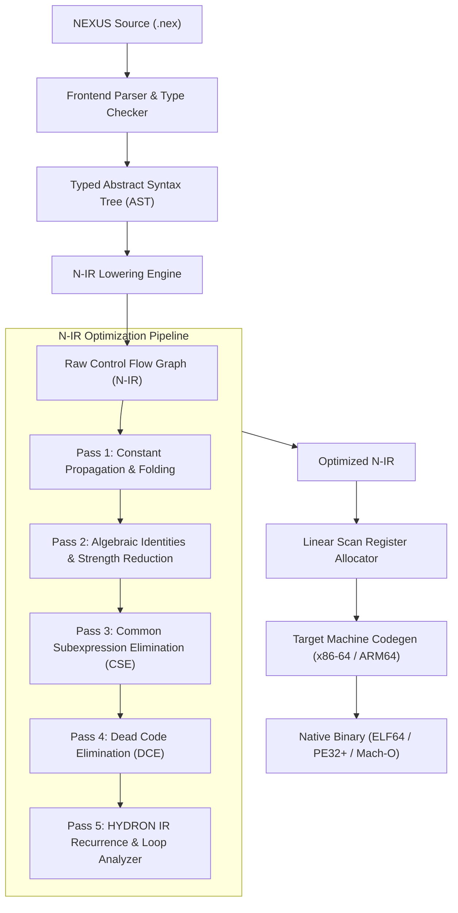

# NEXUS Intermediate Representation (N-IR) Specification
### Architectural Blueprint for the NEXUS v8 Compiler Pipeline

> **Status**: Approved Architecture (v8 Roadmap)  
> **Document Version**: 1.0  
> **Target Toolchain**: NEXUS v8.0+  

---

## 1. Executive Summary & Design Rationale

Prior to NEXUS v8, optimizations were largely implemented as syntactic pattern replacements during source preprocessing (`tools/nexprep.c`) or ad-hoc machine code emissions (`compiler/nexc.nex`). As the language grew to support closures, recursion, frame pointers, and advanced mathematical solvers (HYDRON Turbines 1–7), text-level transformations became fragile and difficult to extend.

**NEXUS Intermediate Representation (N-IR)** is a typed, basic-block-structured, three-address control-flow representation designed to decouple frontend language syntax from backend machine code generation.

### The NEXUS v8 Compiler Pipeline:



---

## 2. N-IR Data Model & Type System

### 2.1 Types
N-IR enforces explicit primitive typing on all virtual values and memory slots:

| Type | Description | Size (Bytes) | Hardware Alignment |
| :--- | :--- | :--- | :--- |
| `i64` | Signed 64-bit integer | 8 | 8 bytes |
| `f64` | IEEE-754 double precision float | 8 | 8 bytes |
| `ptr` | 64-bit memory address / pointer | 8 | 8 bytes |
| `void` | Return type for side-effect-only functions | 0 | None |

### 2.2 Values & Operands
Values in N-IR follow standard compiler nomenclature:

1. **Virtual Registers**: `%name` or `%0`, `%1`, `%2` (immutable SSA-assigned or mutable stack-bound values).
2. **Immediate Constants**:
   - Integer literals: `$42`, `$-100`
   - Float literals: `$3.14159265`
3. **Global Labels / Symbols**:
   - Functions: `@foo`, `@main`
   - Read-only data: `@.str_0`
4. **Basic Block Labels**: `^entry`, `^loop.cond`, `^loop.body`, `^loop.exit`

---

## 3. Instruction Set Architecture (N-IR ISA)

Every instruction in N-IR operates on virtual registers and explicit operands:

### 3.1 Integer Arithmetic & Bitwise
```text
%dst:i64 = add %lhs:i64, %rhs:i64
%dst:i64 = sub %lhs:i64, %rhs:i64
%dst:i64 = mul %lhs:i64, %rhs:i64
%dst:i64 = sdiv %lhs:i64, %rhs:i64    ; C99 truncating integer division
%dst:i64 = srem %lhs:i64, %rhs:i64
%dst:i64 = shl %lhs:i64, %rhs:i64     ; Bitwise left shift
%dst:i64 = sar %lhs:i64, %rhs:i64     ; Arithmetic right shift (preserves sign)
%dst:i64 = and %lhs:i64, %rhs:i64
%dst:i64 = or  %lhs:i64, %rhs:i64
%dst:i64 = xor %lhs:i64, %rhs:i64
%dst:i64 = neg %src:i64
```

### 3.2 Floating-Point Arithmetic
```text
%dst:f64 = fadd %lhs:f64, %rhs:f64
%dst:f64 = fsub %lhs:f64, %rhs:f64
%dst:f64 = fmul %lhs:f64, %rhs:f64
%dst:f64 = fdiv %lhs:f64, %rhs:f64
%dst:f64 = fsqrt %src:f64
%dst:f64 = fneg %src:f64
%dst:f64 = itof %src:i64             ; Convert signed integer to 64-bit float
%dst:i64 = ftoi %src:f64             ; Truncate 64-bit float to signed integer
```

### 3.3 Relational Comparisons
```text
%dst:i64 = icmp_eq  %lhs:i64, %rhs:i64
%dst:i64 = icmp_ne  %lhs:i64, %rhs:i64
%dst:i64 = icmp_slt %lhs:i64, %rhs:i64
%dst:i64 = icmp_sle %lhs:i64, %rhs:i64
%dst:i64 = icmp_sgt %lhs:i64, %rhs:i64
%dst:i64 = icmp_sge %lhs:i64, %rhs:i64

%dst:i64 = fcmp_eq  %lhs:f64, %rhs:f64
%dst:i64 = fcmp_lt  %lhs:f64, %rhs:f64
%dst:i64 = fcmp_le  %lhs:f64, %rhs:f64
```

### 3.4 Memory Operations
```text
%dst:ptr = alloc %size:i64           ; Dynamic heap / mmap allocation
%dst:i64 = load64 [%addr:ptr + $off] ; 64-bit memory load
%dst:i64 = load32 [%addr:ptr + $off] ; 32-bit zero-extended load
%dst:i64 = load16 [%addr:ptr + $off] ; 16-bit zero-extended load
%dst:i64 = load8  [%addr:ptr + $off] ; 8-bit zero-extended load
store64 [%addr:ptr + $off], %val:i64 ; 64-bit memory store
store32 [%addr:ptr + $off], %val:i64
store16 [%addr:ptr + $off], %val:i64
store8  [%addr:ptr + $off], %val:i64
```

### 3.5 Control Flow & Terminators
Every basic block in N-IR must conclude with an explicit terminator instruction:
```text
br ^target_block                      ; Unconditional branch
br_cond %cond:i64, ^then_bb, ^else_bb ; Conditional branch
ret %val                              ; Return value to caller
ret void                              ; Return from void function
call @fn_name, (%arg0, %arg1, ...)    ; Function invocation
```

---

## 4. Canonical N-IR Example: Factorial

### High-level NEXUS Source:
```nexus
fn factorial(n) {
    if n <= 1 {
        return 1
    }
    return n * factorial(n - 1)
}
```

### Canonical Lowered N-IR:
```text
function @factorial(%n:i64) -> i64 {
^entry:
    %c0:i64 = icmp_sle %n, $1
    br_cond %c0, ^then, ^else

^then:
    ret $1

^else:
    %sub1:i64 = sub %n, $1
    %rec:i64 = call @factorial(%sub1)
    %res:i64 = mul %n, %rec
    ret %res
}
```

---

## 5. HYDRON Integration as an IR Pass

In the v8 architecture, **HYDRON** transitions from string pattern matching into an **IR Loop Optimization Pass**:

```text
Loop Basic Block: ^loop.body
  Induction Variable: %i (step $1, limit $lim)
  Recurrence Chain:   %acc_next = sdiv (add %acc, %i), $2
```

1. **Detection**: The pass scans loop headers and extracts the recurrence recurrence matrix $[A, B, C]$.
2. **Attractor Analysis**: Computes fixed point $acc^* = i - 2$.
3. **CFG Restructuring**:
   - Inserts preamble block `^preamble` (64 convergence iterations).
   - Inserts invariance test `^guard`: `icmp_eq %acc, (sub %i, $2)`.
   - Inserts closed-form exit `^closed_form`: `%acc_final = sub $lim, $2`.
   - Links fallback loop `^fallback` in case guard fails.

This guarantees that HYDRON operates deterministically regardless of whether the source code was formatted with intermediate variables, complex expressions, or custom nesting.

---

## 6. Implementation, Native ELF64 Codegen & 7-Way Differential Verification

The reference implementation of the NEXUS v8 N-IR engine and direct native machine code emitter is implemented in [`tools/nexir.c`](file:///home/lifelonglearner/nexus_project/tools/nexir.c) and compiled to [`bin/nexir`](file:///home/lifelonglearner/nexus_project/bin/nexir).

### 6.1 Native x86-64 ELF64 Machine Code Generation
`tools/nexir.c` includes a standalone native machine code emitter capable of compiling typed N-IR directly into executable Linux ELF64 binaries with 0% libc:
- **Stack Frame Layout**: Standard System V AMD64 ABI frame allocation (`rbp`/`rsp`), mapping virtual registers to stack slots with 16-byte alignment.
- **Dynamic Linker & Relocation Engine**: Two-pass label resolution resolving relative branch (`jmp`, `jnz`, `jz`) and call displacements (`rel32`).
- **Direct Linux Syscalls**: Integrated bare-metal subroutines for integer decimal formatting (`_print_i64`), string output (`_print_str`), dynamic heap allocation (`alloc`), and process termination (`sys_exit`).
- **Executable ELF Packaging**: Constructs standard `Elf64_Ehdr` and `Elf64_Phdr` headers with entry point at `0x401000` and RWX data/BSS segments.

### 6.2 Toolchain Commands:
```bash
./nexus ir <file.nex> [out.nir]                  # Lower source to typed CFG N-IR
./nexus ir --opt <file.nex> [out.nir]            # Run 4-pass optimizer (Fold, Algebraic, HYDRON, DCE)
./nexus ir --run <file.nex>                      # Execute source directly via 64-bit N-IR VM
./nexus ir --opt --run <file.nex>                # Execute optimized N-IR directly via VM
./nexus ir --emit-elf <file.nex> [app.elf]       # Compile directly to standalone native Linux ELF64 binary
./nexus ir --opt --emit-elf <file.nex> [app.elf] # Compile optimized N-IR to native Linux ELF64 binary
```

### 6.3 7-Way Differential Fuzzing Oracle:
N-IR is verified continuously by the differential fuzzer ([`tools/nexfuzz.py`](file:///home/lifelonglearner/nexus_project/tools/nexfuzz.py)):

$$\text{Interpreter} \equiv \text{nexc (-O0)} \equiv \text{nexc (HYDRON)} \equiv \text{N-IR VM (-O0)} \equiv \text{N-IR VM (--opt)} \equiv \text{N-IR ELF (-O0)} \equiv \text{N-IR ELF (--opt)}$$

Every randomized and regression test program confirms 100% bit-for-bit semantic identity across all 7 execution engines.


